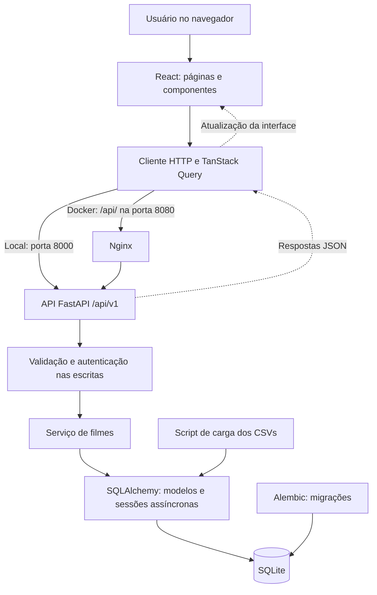

# Sistema de Avaliação de Filmes — RocketLab 2026.2

**Autor: Gabriel Victalino**

Sistema de catálogo e avaliação de filmes inspirado no Letterboxd, desenvolvido para o RocketLab 2026.2. Permite explorar filmes, consultar suas informações e ler avaliações. Um administrador pode cadastrar, editar e remover filmes, além de publicar notas e resenhas.

A consulta é pública. As operações de escrita exigem login e são protegidas também pela API. As notas vão de **0 a 10**, incluindo zero e valores decimais.

## Funcionalidades

- Catálogo paginado, busca por título e filtros combináveis de gênero, ano, produtora e nota mínima.
- Ficha com sinopse, direção, elenco, roteiro, produtoras, datas, duração, informações financeiras e avaliações paginadas.
- Cadastro, edição e exclusão de filmes, com confirmação antes da remoção.
- Publicação de notas e resenhas, com atualização da média do filme.
- Área administrativa, interface responsiva e cache de consultas no frontend.
- Importação por CSV e dados fictícios incluídos para experimentar o sistema.

## Stack utilizada

| Camada | Tecnologias e responsabilidades |
| --- | --- |
| Backend | Python, FastAPI e Uvicorn para a API HTTP; Pydantic e pydantic-settings para validação e configuração. |
| Persistência | SQLAlchemy 2 com sessões assíncronas, aiosqlite e SQLite; Alembic para migrações. |
| Frontend | React 19, TypeScript e Vite; React Router para navegação, TanStack Query para consultas e cache, CSS próprio. |
| Contêineres | Docker Compose para os serviços e Nginx para servir a interface compilada e encaminhar chamadas à API. |
| Qualidade e documentação | pytest, HTTPX e Ruff no backend; Vitest e Testing Library no frontend; Storybook para componentes e Swagger UI para a API. |

## Arquitetura

O frontend é uma aplicação de página única. O React Router seleciona as páginas, o cliente HTTP se comunica com a API REST sob `/api/v1` e o TanStack Query mantém o cache das consultas, invalidando-o após alterações.

No backend, as rotas recebem as requisições, os schemas validam os dados e o serviço de filmes concentra as regras de negócio. O SQLAlchemy acessa o SQLite por sessões assíncronas. O Alembic prepara a estrutura do banco e o script de carga importa os CSVs.



No Docker, o Nginx também entrega os arquivos do frontend. Localmente, o Vite serve a interface na porta `5173`. O banco local fica em `backend/rocketlab.db`; no Docker, usa um volume separado chamado `sqlite-data`.

### Organização das pastas

```text
.
├── backend/
│   ├── app/
│   │   ├── api/v1/       # Agrupamento das rotas e autenticação
│   │   ├── core/         # Configuração, segurança e logging
│   │   ├── db/           # Base dos modelos e sessões do banco
│   │   ├── movies/       # Modelos, schemas, rotas e regras de filmes
│   │   ├── scripts/      # Credenciais e importação de CSVs
│   │   └── main.py       # Inicialização da API
│   ├── data/             # Dez CSVs de demonstração
│   ├── migrations/       # Migrações do Alembic
│   ├── tests/            # Testes do backend
│   ├── .env.example      # Configuração local de referência
│   └── Dockerfile
├── frontend/
│   ├── .storybook/       # Configuração do Storybook
│   ├── public/           # Arquivos estáticos
│   ├── src/
│   │   ├── components/   # Componentes reutilizáveis e histórias
│   │   ├── pages/        # Catálogo, detalhes, login e edição/cadastro
│   │   ├── test/         # Testes e fixtures
│   │   ├── api.ts        # Comunicação HTTP com a API
│   │   ├── auth.tsx      # Autenticação e proteção de rotas
│   │   ├── App.tsx       # Definição das rotas da interface
│   │   └── main.tsx      # Inicialização do React e provedores
│   ├── .env.example      # Configuração local de referência
│   ├── nginx.conf        # Servidor e proxy usados no Docker
│   └── Dockerfile
├── scripts/check.py      # Verificação integrada
├── .env.example          # Configuração do Docker Compose
└── compose.yaml          # Serviços e volume do Docker
```

## Como executar

Obtenha o código pelo download do repositório ou pelo Git:

```sh
git clone https://github.com/gabrielvictalino/rocketlab2026-2.git
cd rocketlab2026-2
```

Se já tem o projeto, abra um terminal na pasta que contém `compose.yaml`. Escolha uma das formas abaixo. Ambas oferecem o mesmo sistema, mas usam bancos separados. Evite executá-las simultaneamente nas portas padrão.

Ao copiar configurações, **se o `.env` de destino já existir, preserve seus valores e acrescente apenas o que faltar**.

### Com Docker

#### 1. Preparar o ambiente

Instale e inicie o Docker Desktop com contêineres Linux, ou utilize Docker Engine com o plugin Docker Compose no Linux. Verifique a instalação:

```sh
docker --version
docker compose version
```

Python, Node.js e npm são executados nas imagens e não precisam estar instalados no computador. Execute todos os comandos desta subseção na **raiz do projeto**.

#### 2. Configurar as variáveis e as credenciais

Copie o exemplo de configuração da raiz.

**PowerShell:**

```powershell
Copy-Item .env.example .env
```

**Linux/macOS:**

```sh
cp .env.example .env
```

Compile as imagens e execute o gerador interativo de credenciais:

```sh
docker compose build
docker compose run --rm --no-deps backend python -m app.scripts.admin
```

Informe e confirme uma senha com **pelo menos 12 caracteres**. O comando imprime `ADMIN_PASSWORD_HASH` e `AUTH_SECRET`. Abra o `.env` da raiz em um editor e substitua essas duas configurações pelas linhas geradas, **preservando as aspas simples**, pois o hash contém `$`. A senha digitada será usada no login; o hash não é a senha de acesso.

| Variável no `.env` da raiz | Finalidade |
| --- | --- |
| `WEB_PORT=8080` | Porta da interface. |
| `API_PORT=8000` | Porta de acesso direto à API e sua documentação. |
| `ADMIN_USERNAME=admin` | Nome de usuário para login. |
| `ADMIN_PASSWORD_HASH` | Hash da senha produzido pelo gerador. |
| `AUTH_SECRET` | Segredo produzido pelo gerador para assinar os tokens. |
| `AUTH_TOKEN_TTL_SECONDS=3600` | Validade da sessão em segundos. |

O Compose usa o `.env` da raiz. Não é necessário configurar `backend/.env` nem `frontend/.env` nesta execução.

#### 3. Iniciar os serviços

```sh
docker compose up -d --build
docker compose ps
```

O backend aplica as migrações automaticamente antes de iniciar. O frontend inicia após a verificação de saúde da API. Se houver falha, consulte `docker compose logs -f`; use `Ctrl+C` para sair da visualização dos logs.

#### 4. Carregar os dados de exemplo

Com o backend em execução:

```sh
docker compose exec backend python -m app.scripts.seed /app/seed-data
```

A carga inclui **8 filmes fictícios e 16 avaliações** de `backend/data`; não corresponde aos dados oficiais do desafio. Ela é manual e pode ser repetida sem duplicar os registros importados. Sem a carga, o catálogo começa vazio e permite cadastrar filmes após o login.

#### 5. Acessar e encerrar

| Recurso | Endereço padrão |
| --- | --- |
| Aplicação | [localhost:8080](http://localhost:8080) |
| Documentação da API | [localhost:8000/docs](http://localhost:8000/docs) |
| Saúde da API | [localhost:8000/health](http://localhost:8000/health) |

Se alterar `WEB_PORT` ou `API_PORT`, use as portas escolhidas nos endereços. Depois de modificar configurações ou credenciais no `.env`, execute `docker compose up -d` novamente.

Para encerrar:

```sh
docker compose down
```

Esse comando preserva o banco no volume. **Adicionar `-v` apaga o volume e seus dados.** A configuração fornecida expõe as portas apenas no computador local.

### Localmente: backend e frontend

#### 1. Preparar o ambiente

Instale **Python 3.11 ou superior**, **Node.js 22.18+ ou 24** e **npm**. Não é necessário instalar um servidor de banco de dados: o SQLite usa um arquivo local.

Use dois terminais: um para o backend e outro para o frontend. No Windows, se `npm.ps1` estiver bloqueado, substitua `npm` por `npm.cmd` nos comandos.

#### 2. Instalar o backend

No primeiro terminal, começando na raiz do projeto:

**PowerShell:**

```powershell
cd backend
python -m venv .venv
.\.venv\Scripts\Activate.ps1
python -m pip install -e ".[dev]"
Copy-Item .env.example .env
```

Se a ativação estiver bloqueada, use `.\.venv\Scripts\python.exe` no lugar de `python` nos comandos seguintes do backend, inclusive na instalação.

**Linux/macOS:**

```sh
cd backend
python3 -m venv .venv
source .venv/bin/activate
python -m pip install -e ".[dev]"
cp .env.example .env
```

#### 3. Configurar o backend e o administrador

Ainda em `backend/`, com o ambiente virtual ativo:

```sh
python -m app.scripts.admin
```

Informe e confirme uma senha com pelo menos 12 caracteres. Copie as linhas geradas de `ADMIN_PASSWORD_HASH` e `AUTH_SECRET` para **`backend/.env`**, substituindo os valores vazios e mantendo as aspas simples.

| Variável em `backend/.env` | Valor de referência / finalidade |
| --- | --- |
| `DATABASE_URL` | `sqlite+aiosqlite:///./rocketlab.db`, banco em `backend/rocketlab.db`. |
| `BACKEND_CORS_ORIGINS` | `["http://localhost:5173"]`, origem permitida para o frontend. |
| `ADMIN_USERNAME` | `admin`, usuário do administrador. |
| `ADMIN_PASSWORD_HASH` / `AUTH_SECRET` | Valores obtidos no comando anterior. |
| `AUTH_TOKEN_TTL_SECONDS` | `3600`, validade da sessão em segundos. |
| `ENVIRONMENT` | `local`, habilita o log SQL. |
| `LOG_LEVEL` | `INFO`, nível de logging. |
| `PROJECT_VERSION` | `2026.2`, versão informada pela API. |

Execute os comandos do backend dentro de `backend/`: os caminhos do `.env` e do SQLite são relativos ao diretório de execução. Se acessar a interface por `http://127.0.0.1:5173`, inclua também essa origem no array `BACKEND_CORS_ORIGINS`.

#### 4. Criar as tabelas e carregar os dados

No mesmo terminal, execute nesta ordem:

```sh
python -m alembic upgrade head
python -m app.scripts.seed data
```

O primeiro comando prepara o banco; o segundo importa os **8 filmes fictícios e 16 avaliações** de `backend/data`. A carga pode ser repetida sem duplicar registros. A aplicação e o script de carga não criam as tabelas por conta própria, por isso a migração deve ocorrer primeiro.

#### 5. Iniciar o backend

```sh
python -m uvicorn app.main:app --reload --host 127.0.0.1 --port 8000
```

Deixe esse terminal aberto. Verifique a API em [localhost:8000/health](http://localhost:8000/health) ou abra a documentação em [localhost:8000/docs](http://localhost:8000/docs).

#### 6. Instalar e configurar o frontend

No **segundo terminal**, começando na raiz do projeto:

```sh
cd frontend
npm ci
```

Copie a configuração de exemplo.

**PowerShell:**

```powershell
Copy-Item .env.example .env
```

**Linux/macOS:**

```sh
cp .env.example .env
```

O arquivo `frontend/.env` deve conter:

```dotenv
VITE_API_URL=http://localhost:8000/api/v1
VITE_QUERY_STALE_TIME_MS=30000
```

`VITE_API_URL` indica onde a API está disponível; ajuste-a se mudar a porta do backend. A segunda variável define por quanto tempo os dados consultados são considerados atualizados no cache, em milissegundos. Variáveis `VITE_*` são públicas: não coloque senhas ou segredos nelas.

#### 7. Iniciar e acessar a interface

Ainda em `frontend/`:

```sh
npm run dev
```

Abra [localhost:5173](http://localhost:5173). Mantenha os dois terminais em execução; use `Ctrl+C` em cada um para encerrar. O banco permanece em `backend/rocketlab.db`.

Se o Vite selecionar outra porta por a padrão estar ocupada, libere a porta `5173` ou ajuste `BACKEND_CORS_ORIGINS` para a origem efetivamente usada. Reinicie o processo correspondente após alterar arquivos `.env`.

## Como experimentar o sistema

1. Abra a aplicação e explore o catálogo. Busque um título, combine filtros e consulte a ficha de um filme.
2. Clique em **Área admin** e entre com o usuário configurado em `ADMIN_USERNAME` (padrão `admin`) e a senha definida no gerador.
3. Use **+ Novo filme** para cadastrar um filme. Na página de detalhes, experimente a edição e o envio de uma avaliação com nota entre 0 e 10.
4. Confira a avaliação e a média atualizada. Para testar a exclusão, remova o filme que acabou de criar e confirme a ação.
5. Clique em **Sair** para retornar à consulta pública.

Não existe cadastro público de usuários: o administrador é definido pela configuração. O token fica na memória do navegador, portanto recarregar a página exige novo login. Sem `ADMIN_PASSWORD_HASH` e `AUTH_SECRET`, a consulta continua disponível, mas login e operações de escrita retornam erro `503`.

## Verificação e documentação

### Testes e build

Após instalar as dependências locais do backend e frontend, execute na raiz:

**PowerShell:**

```powershell
.\backend\.venv\Scripts\python.exe scripts/check.py
```

**Linux/macOS:**

```sh
backend/.venv/bin/python scripts/check.py
```

O script executa Ruff, pytest, Vitest, build TypeScript/Vite e build do Storybook. Os testes do backend usam bancos temporários preparados pelo Alembic, sem alterar o banco da aplicação. Para verificar somente o backend, acrescente `--backend-only`.

Em ambientes com restrições de leitura que impeçam o esbuild de funcionar, a opção `--restricted` usa o carregador nativo do Vite e compila apenas a prévia do Storybook, sem sua interface de navegação. Esse modo não substitui a verificação completa do Storybook.

Para executar separadamente, dentro de `backend/` e com o ambiente virtual ativo:

```sh
python -m ruff check app tests
python -m pytest -q
python -m alembic check
```

Dentro de `frontend/`:

```sh
npm test
npm run build
```

### Storybook

Com as dependências do frontend instaladas, execute em `frontend/`:

```sh
npm run storybook
```

Abra [localhost:6006](http://localhost:6006) para explorar os componentes de catálogo, detalhes e formulários com dados locais, sem precisar iniciar a API. Para gerar a versão estática, execute `npm run build-storybook`; a saída fica em `frontend/storybook-static/`.

### Documentação da API

Com o backend em execução, acesse [Swagger UI](http://localhost:8000/docs). A página descreve os parâmetros, schemas e respostas, e permite experimentar os endpoints. No Docker, ajuste a URL se tiver alterado `API_PORT`.

Os principais recursos sob `/api/v1` são `/movies`, `/movies/filters`, `/movies/{id}`, `/movies/{id}/reviews` e `/auth/login`. As consultas de filmes são públicas. Para escrever pela API, faça login com `username` e `password` e envie o `access_token` retornado no cabeçalho `Authorization: Bearer <token>`.

### Importar outro lote de CSVs

O lote completo usa dez arquivos: `dim_movies.csv`, `dim_genres.csv`, `dim_companies.csv`, `dim_people.csv`, `bridge_movie_genre.csv`, `bridge_movie_company.csv`, `bridge_movie_person.csv`, `fact_movies_performance.csv`, `dim_reviews.csv` e `movies_reviews.csv`.

Use UTF-8, separador vírgula e cabeçalhos correspondentes aos campos das tabelas, seguindo os exemplos em `backend/data`. Datas usam `AAAA-MM-DD` e números decimais usam ponto. A importação é transacional: se um registro for inválido, o lote é revertido. Reexecuções atualizam registros pelas chaves, sem duplicá-los nem excluir registros ausentes dos CSVs.

Localmente, execute em `backend/`, com o ambiente virtual ativo e o banco já migrado, substituindo o caminho pela pasta do lote:

```sh
python -m app.scripts.seed /caminho/para/csvs
```

No Docker, a partir da raiz e com os serviços em execução:

```sh
docker compose cp ./meus-csvs backend:/tmp/meus-csvs
docker compose exec backend python -m app.scripts.seed /tmp/meus-csvs
```
